<div align="center">
  
</div>

<div align="center">
  
</div>

<br>

<div align="center">
  
</div>

<br>

<div align="center">
  
  
  
  
  
  
  
   <br>
  
   
  
  
  
  
  

</div> <br>


<div align="center">
<h3>𝐃𝐄𝐕𝐄𝐋𝐎𝐏𝐄𝐑 𝐌𝐄𝐓𝐑𝐈𝐂𝐒</h3>
</div>

<div align="center">
  
<table><tr><td>

</td><td>

</td></tr></table>


</div>


<div>

## 📦 Featured Project — incog-validate

> **Fast, type-safe validation library with async, conditional, nested schema, pipeline, batch, and benchmark support. Zero dependencies. Works in Node.js and browser.**

````bash
npm install @incogdev/validate
````

[](https://www.npmjs.com/package/@incogdev/validate)
[](https://opensource.org/licenses/MIT)
[](https://nodejs.org/)
[](https://www.npmjs.com/package/@incogdev/validate)

**13 validation rules · 9 advanced features**

| Category | Highlights |
|:---|:---|
| **Rules** | Email, phone, URL, strong password, credit card, IP, postal code |
| **Chainable** | required, email, minLength, maxLength, isNumber, strongPassword |
| **Schema** | Object validation with type checking |
| **Async** | Database checks and custom async rules |
| **Conditional** | Dynamic validation with if/unless |
| **Nested** | Deeply nested object validation |
| **Pipeline** | Transform values before validation |
| **Batch** | Validate multiple fields at once |
| **Benchmark** | Performance testing |

**Stars:** 13 · [](https://www.typescriptlang.org/) · [](https://opensource.org/licenses/MIT)
  
</div>


<div align="center">
<h3>𝐂𝐎𝐍𝐓𝐑𝐈𝐁𝐔𝐓𝐈𝐎𝐍 𝐓𝐑𝐀𝐈𝐋</h3>
</div>

<div align="center">
  
</div>

<br>

<div align="center">

<table><tr><td width="120" align="center">
  
</td>
<td width="480" align="center">
  
  
  
</td></tr></table>

</div>


<div align="center">
  
</div>
